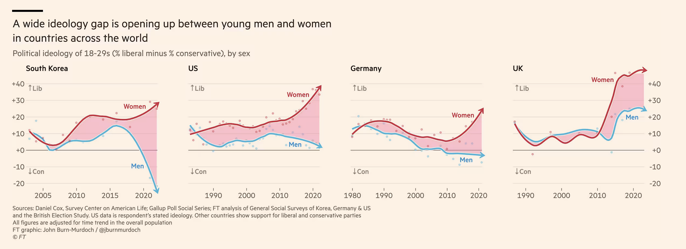

# Case study : gender and voting for the radical right

Recent debates in academia have focused on the impact of gender on voting for the radical right. While some scholars argue that women vote less for the radical right, others argue that this effect of gender may depend on the context. Some authors even suggest that the radical right has renewed its electoral appeal to women by developing so-called “femo-nationalism”—a form of nationalism that incorporates elements of feminism. This academic debate has also resonated in the public sphere, as illustrated by the Financial Times’ 2024 paper (Burn-Murdoch, 2024) entitled "A New Global Gender Divide Is Emerging".

 {width=100%}


For this reason, researchers have recently sought to understand whether gender has a positive or negative effect on voting for the radical right in France, particularly in the European and legislative elections (Piolat, N., Mayer, N., Durovic, A., 2025). Their papers are available [here](https://journals.openedition.org/ress/12111) and [here](https://shs.cairn.info/revue-revue-francaise-de-science-politique-2025-1-page-39?lang=fr). In order to replicate and complement their findings, you are provided with a simplified dataset they used to conduct their analysis. Using R, you are asked to answer the following questions (by groups of 2 or 3) and submit the code you used in either a PDF or HTML file.

1. Download the dataset following <https://github.com/scpo-quantimethods/quantitative_methods_two/raw/main/sessions/session2/data/poll2024.RData> and import it into your local R environment.

2. If you are interested in how voting for the radical right varies by gender, determine:
- **Your dependent variable** 
- **Your independent variable** 
Are they continuous, categorical ? Drop all the variables except `second_round_vote, gender, union_member, diploma`, `religious_affiliation`, `income` and `birth_year`.

3. The dataset is in .stata format. You can inspect the different values a variable takes by calling: `attributes(data_set$variable)` - it basically contains the codebook. Do that for variable `second_round_vote`. Then, create the following variables:
- `voteRN` = 1 if the respondent voted for RN in the second round, 0 otherwise (NA if no answer)
- Using 2026 as the reference year, create a variable `age`. 

4. Define a variable `female = 1` if the respondent identifies as a woman, 0 if male, and `NA_integer_` otherwise (too few respondents in other categories or no answer).
- Clean `union_member, diploma, religion`, and `income` by recoding non-responses as `NA`.
- Create a nominal variable `cohort` by grouping ages into decades: `20-29, 30–39, 40–49, …, 80+`, then run 
```{r}
#| eval: false
data$cohort <- factor(
  data$cohort,
  levels = c("20-29","30-39","40-49","50-59","60-69","70-79","80+"),
  ordered = FALSE
)
```
to make sure the cohorts are logically ordered.

5. Plot a histogram of the `age` variable with 10 breaks. Identify the most frequent decade in the dataset.

6. Run a logistic regression predicting the probability of voting for RN based on gender and age. Interpret the results:
- How does a one-year increase in age affect the odds of voting for RN?
- How does being a woman affect the odds ratio?

7. Include `as.factor(diploma)` in the regression. Compare models using `stargazer()` by adapting the code below, which exponentiates the coefficients from your logistic regressions and adds the exponentiated values to the stargazer table:
```{r}
#| eval: false
exp_coef1 <- exp(coef(model1))
exp_coef2 <- exp(coef(model2))

exp_ci1 <- exp(confint(model1))
exp_ci2 <- exp(confint(model2))

stargazer(model1, model2,
          type = "text",            
          coef = list(exp_coef1, exp_coef2),
          ci = TRUE,
          ci.custom = list(exp_ci1, exp_ci2),
          p.auto = FALSE,
          title = "Logistic Regression (Odds Ratios)")
```
Interpret the results: How does attending a “grande école” affect the odds of voting for the RN? Is the coefficient on gender still significant ?

8. Include in the regression `religion, union_member`, and `income`. Only use as.factor(variable) for nominal variables with more than two categories. If it appears, disregard the following warning : `Warning: glm.fit: fitted probabilities numerically 0 or 1 occurred`.
- Compare your results. Some religious practices may substantially reduce the odds of voting for RN. Which religions are these? Are the results in line with your expectations?
- Replace `age` with your cohort variable. Which cohort is most likely to vote for RN? 

9. Run a logistic regression including the interaction `age*female`. Plot the interaction results using `library(ggeffects)` and `ggpredict`. Hint: use `geom_ribbon()` to display confidence intervals.

10. Run a similar regression with `female*cohort` and plot the interactions using `library(ggeffects)` and `ggpredict()`. Hint: use `geom_errorbar()` to display confidence intervals.

11. Bonus point: Repeat the analysis of question 8 and 9, 10 for the first round of legislative elections. Compare the results with the second round in a text of 5 lines max. 


# References
- Burn-Murdoch, John. 2024. “A New Global Gender Divide Is Emerging.” Financial Times. https://www.ft.com/content/29fd9b5c-2f35-41bf-9d4c-994db4e12998 (January 30, 2026).
- Durovic, Anja, Nonna Mayer, and Noémie Piolat. 2025. “Ni tout à fait le même ni tout à fait un autre:Le vote aux élections législatives de 2024 au prisme du genre et de l’âge.” Revue française de science politique 75(1): 39–65. doi:10.3917/rfsp.751.0039.
- Durovic, Anja, Nonna Mayer, and Noémie Piolat. 2025. “How Gender and Attitudes towards Gender and Sexuality Shaped Votes in the 2024 European Parliament Elections in France.” Revue européenne des sciences sociales. European Journal of Social Sciences (63–2): 71–97. doi:10.4000/1596h.


```{r}
#| echo: false
#| eval: false

library(rio)
library(ggplot2)
library(tidyverse)
library(stargazer)
library(ggeffects)
#1.1
dataset <- import("/Users/paulservais/Library/CloudStorage/ProtonDrive-paservai@protonmail.com-folder/Website/quantitative_methods_two/sessions/session2/data/poll2024.RData")
#1.2
#DV : radical right voting (binary)
#IV : gender (binary)

#1.3, 1.4

data <- dataset %>% mutate(
  voteRN = case_when(
    first_round_vote == 1 ~ 1,
    (first_round_vote > 1 & first_round_vote <= 7) ~ 0,
    TRUE ~ NA_integer_
  ),
  voteREC = case_when(
    first_round_vote == 5 ~ 1,
    (first_round_vote != 5 & first_round_vote <= 7) ~ 0,
    TRUE ~ NA_integer_
  ),
  voteRR = case_when(
    first_round_vote == 5 |first_round_vote == 1  ~ 1,
    (first_round_vote != 5 & first_round_vote <= 7) ~ 0,
    TRUE ~ NA_integer_
  ),
  female = case_when(
    gender == 1 ~ 0,
    gender == 2 ~ 1,
    TRUE ~ NA_integer_
  ),
  union = case_when(
    union_member == 1 ~ 1,
    union_member == 2 | union_member == 3 ~ 0,
    TRUE ~ NA_integer_
  ),
  educ = case_when(
    diploma > 20 ~ NA_integer_,
    TRUE ~ diploma
  ),
  religion = case_when(
    religious_affiliation > 9 ~ NA_integer_,
    TRUE ~ religious_affiliation
  ),
  age = 2026-birth_year,
  income = case_when(
    income <= 11 ~ income,
    TRUE ~ NA_integer_
  ),
  cohort = case_when(
    age < 30 ~ "20-29",
    age >= 30 & age < 40 ~ "30-39",
    age >= 40 & age < 50 ~ "40-49",
    age >= 50 & age < 60 ~ "50-59",
    age >= 60 & age < 70 ~ "60-69",
    age >= 70 & age < 70 ~ "70-79",
    age >= 80 ~ "80+",
    TRUE ~ NA_character_
  )
)

data$cohort <- factor(
  data$cohort,
  levels = c("20-29","30-39","40-49","50-59","60-69","70-79","80+"),
  ordered = FALSE
)


#1.5
hist((data$age), breaks = 10)
hist((data %>% filter(female == 1))$age, breaks = 10)

#1.6 & 1.7
logit1 <- glm(
  voteRN ~ female + age,
  data = data,
  family = "binomial")

logit2 <- glm(
  voteRN ~ female + age + as.factor(educ),
  data = data,
  family = "binomial")

exp_coef1 <- exp(coef(logit1))
exp_coef2 <- exp(coef(logit2))

exp_ci1 <- exp(confint(logit1))
exp_ci2 <- exp(confint(logit2))

stargazer(logit1, logit2,
          type = "text",            
          coef = list(exp_coef1, exp_coef2),
          ci = TRUE,
          ci.custom = list(exp_ci1, exp_ci2),
          p.auto = FALSE,
          title = "Logistic Regression (Odds Ratios)")

#1.8

logit3 <- glm(
  voteRN ~ female + age + as.factor(educ) + union + as.factor(religion) +income,
  data = data,
  family = "binomial")


exp_coef3 <- exp(coef(logit3))
exp_ci3 <- exp(confint(logit3))


stargazer(logit1, logit2, logit3,
          type = "text",            
          coef = list(exp_coef1, exp_coef2, exp_coef3),
          ci = TRUE,
          ci.custom = list(exp_ci1, exp_ci2, exp_ci3),
          p.auto = FALSE,
          title = "Logistic Regression (Odds Ratios)")

#1.9
logit5 <- glm(
  voteRN ~ female*age + as.factor(educ) + union + as.factor(religion) + as.factor(income),
  data = data,
  family = "binomial")

pred <- ggpredict(logit5, terms = c("age", "female"))

ggplot(pred, aes(x = x, y = predicted, color = group)) +
    geom_line(size = 1.2) +
    geom_ribbon(aes(ymin = conf.low, ymax = conf.high, fill = group),
                alpha = 0.2, color = NA) +
    labs(
        x = "Age",
        y = "Predicted probability of voting RN",
        color = "Gender",
        fill = "Gender"
    ) +
    theme_minimal() +
    theme(text = element_text(size = 14))

#1.10

logit6 <- glm(
  voteRN ~ female*cohort + as.factor(educ) + union + as.factor(religion) + as.factor(income),
  data = data,
  family = "binomial")

predicted_probs_gender <- ggpredict(logit6, terms = c("cohort", "female"))

ggplot(predicted_probs_gender,
       aes(x = x, y = predicted, fill = group)) +
  geom_errorbar(aes(ymin = conf.low, ymax = conf.high),
                width = 0.2,
                position = position_dodge(width = 0.5)) +
  geom_point(shape = 21, size = 5, position = position_dodge(width = 0.5)) +
  labs(title = "Predicted Probability of Voting by Gender",
       x = "Cohort",
       y = "Predicted Probability of Voting",
       fill = "Gender") +
  theme_minimal()


```
