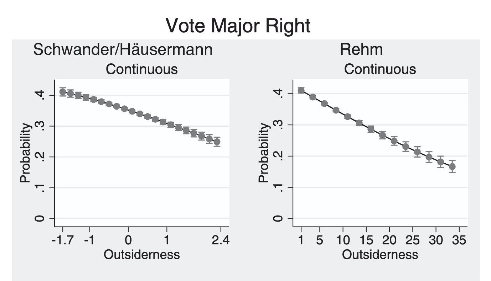

## Two weeks ago
- Descriptive statistics
- RStudio
- Linear regressions
- Diagnostics

## This week

- Homework with material covered in session 1 and 2 
- You will receive it today (e-mail)
- Radical right voting in France, gender and age


## The logic
- Linear regressions are good for continuous DVs
- What if Y is binary and your IV continuous ?
- Many dependent variables are binary in political science...
- Eg. turnout, voting at the individual level


## An example {.scrollable}
- Rovny's

- interest in outsiderness and occupational structure as variables explaining voting (political sociology)
- Dependent Variable = voting at the individual level: binary
- IV = different definitions of 'outsiderness' in the labour market, depending on individual characteristics (continuous metric)

## An example {.scrollable}


- how do you get to predicted probabilities ?

## Your scatter plot
```{r}
# Load necessary library
# Load necessary library
library(ggplot2)

set.seed(123)

# Simulate continuous independent variable
n <- 300
x <- rnorm(n, mean = 0, sd = 1)

# Create probability using logistic function
true_prob <- 1 / (1 + exp(-( -1 + 2*x )))

# Generate binary outcome
y <- rbinom(n, size = 1, prob = true_prob)

data <- data.frame(x = x, y = y)

# Fit models
linear_model  <- lm(y ~ x, data = data)
logit_model   <- glm(y ~ x, data = data, family = binomial)

# Create prediction grid
x_seq <- seq(min(x), max(x), length.out = 200)
pred_data <- data.frame(x = x_seq)

pred_data$linear_pred <- predict(linear_model, newdata = pred_data)
pred_data$logit_pred  <- predict(logit_model, newdata = pred_data, type = "response")

# Plot
ggplot(data, aes(x = x, y = y)) +
  geom_jitter(height = 0.05, alpha = 0.4) +
  labs(title = "Linear vs Logistic Regression for Binary Outcome",
       subtitle = " ",
       x = "Continuous Independent Variable",
       y = "Binary Outcome (0/1) - (e.g. voting)") +
  theme_minimal()

```

## A linear regression 
```{r}
# Load necessary library
# Load necessary library
library(ggplot2)

set.seed(123)

# Simulate continuous independent variable
n <- 300
x <- rnorm(n, mean = 0, sd = 1)

# Create probability using logistic function
true_prob <- 1 / (1 + exp(-( -1 + 2*x )))

# Generate binary outcome
y <- rbinom(n, size = 1, prob = true_prob)

data <- data.frame(x = x, y = y)

# Fit models
linear_model  <- lm(y ~ x, data = data)
logit_model   <- glm(y ~ x, data = data, family = binomial)

# Create prediction grid
x_seq <- seq(min(x), max(x), length.out = 200)
pred_data <- data.frame(x = x_seq)

pred_data$linear_pred <- predict(linear_model, newdata = pred_data)
pred_data$logit_pred  <- predict(logit_model, newdata = pred_data, type = "response")

# Plot
ggplot(data, aes(x = x, y = y)) +
  geom_jitter(height = 0.05, alpha = 0.4) +
  geom_line(data = pred_data, aes(y = linear_pred), 
            color = "red", size = 1.2) +
  labs(title = "Linear vs Logistic Regression for Binary Outcome",
       subtitle = "Red = Linear Regression | Blue = Logistic Regression",
       x = "Continuous Independent Variable",
       y = "Binary Outcome (0/1)") +
  theme_minimal()

```
## A linear regression
- Violates several assumptions about linear models
- Heteroskedastic
- Irrelevant

## But there are probabilities... {.scrollable}
- Take different intervals of X
```{r}
library(ggplot2)

set.seed(123)

# Simulate continuous independent variable
n <- 300
x <- rnorm(n, mean = 0, sd = 1)

# Create probability using logistic function
true_prob <- 1 / (1 + exp(-( -1 + 2*x )))

# Generate binary outcome
y <- rbinom(n, size = 1, prob = true_prob)

data <- data.frame(x = x, y = y)

# ---- Create 3 equal-width intervals of x ----
breaks <- seq(min(data$x), max(data$x), length.out = 4)
data$x_group <- cut(data$x, breaks = breaks, include.lowest = TRUE)

# Fit models
linear_model  <- lm(y ~ x, data = data)
logit_model   <- glm(y ~ x, data = data, family = binomial)

# Create prediction grid
x_seq <- seq(min(x), max(x), length.out = 200)
pred_data <- data.frame(x = x_seq)

pred_data$linear_pred <- predict(linear_model, newdata = pred_data)
pred_data$logit_pred  <- predict(logit_model, newdata = pred_data, type = "response")

# Plot
ggplot(data, aes(x = x, y = y, color = x_group)) +
  geom_jitter(height = 0.05, alpha = 0.6) +
  geom_line(data = pred_data, aes(y = logit_pred), 
            color = "blue", size = 1.2) +
  labs(title = "Linear vs Logistic Regression for Binary Outcome",
       subtitle = "Red = Linear Regression | Blue = Logistic Regression",
       x = "Continuous Independent Variable",
       y = "Binary Outcome (0/1)",
       color = "X Interval") +
  theme_minimal()

```

- it is continuous :

```{r}
ggplot(data, aes(x = x, y = y, color = x)) +
  
  # Points
  geom_jitter(height = 0.06, size = 2.5, alpha = 0.8) +
  
  # Logistic regression (main focus)
  geom_line(data = pred_data, 
            aes(x = x, y = logit_pred),
            inherit.aes = FALSE,
            color = "#2C3E50",
            linewidth = 1.6) +
  
  # Linear regression (lighter, secondary)
  geom_line(data = pred_data, 
            aes(x = x, y = linear_pred),
            inherit.aes = FALSE,
            color = "#E74C3C",
            linewidth = 1.2,
            linetype = "dashed") +
  
  # Beautiful continuous gradient
  scale_color_viridis_c(option = "plasma", direction = -1) +
  
  labs(
    title = "Why Logistic Regression Fits Binary Data Better",
    subtitle = "Solid curve = Logistic model | Dashed line = Linear model",
    x = "Continuous Predictor (x)",
    y = "Probability / Binary Outcome",
    color = "Value of x"
  ) +
  
  theme_minimal(base_size = 15) +
  theme(
    plot.title = element_text(face = "bold"),
    panel.grid.minor = element_blank(),
    legend.position = "right"
  )
```
## A logistic regression
```{r}
# Load necessary library
# Load necessary library
library(ggplot2)

set.seed(123)

# Simulate continuous independent variable
n <- 300
x <- rnorm(n, mean = 0, sd = 1)

# Create probability using logistic function
true_prob <- 1 / (1 + exp(-( -1 + 2*x )))

# Generate binary outcome
y <- rbinom(n, size = 1, prob = true_prob)

data <- data.frame(x = x, y = y)

# Fit models
linear_model  <- lm(y ~ x, data = data)
logit_model   <- glm(y ~ x, data = data, family = binomial)

# Create prediction grid
x_seq <- seq(min(x), max(x), length.out = 200)
pred_data <- data.frame(x = x_seq)

pred_data$linear_pred <- predict(linear_model, newdata = pred_data)
pred_data$logit_pred  <- predict(logit_model, newdata = pred_data, type = "response")

# Plot
ggplot(data, aes(x = x, y = y)) +
  geom_jitter(height = 0.05, alpha = 0.4) +
  geom_line(data = pred_data, aes(y = linear_pred), 
            color = "red", size = 1.2) +
  geom_line(data = pred_data, aes(y = logit_pred), 
            color = "blue", size = 1.2) +
  labs(title = "Linear vs Logistic Regression for Binary Outcome",
       subtitle = "Red = Linear Regression | Blue = Logistic Regression",
       x = "Continuous Independent Variable",
       y = "Binary Outcome (0/1)") +
  theme_minimal()

```

## A logistic regression
```{r}
# Load necessary library
# Load necessary library
library(ggplot2)

set.seed(123)

# Simulate continuous independent variable
n <- 300
x <- rnorm(n, mean = 0, sd = 1)

# Create probability using logistic function
true_prob <- 1 / (1 + exp(-( -3 + 10*x )))

# Generate binary outcome
y <- rbinom(n, size = 1, prob = true_prob)

data <- data.frame(x = x, y = y)

# Fit models
linear_model  <- lm(y ~ x, data = data)
logit_model   <- glm(y ~ x, data = data, family = binomial)

# Create prediction grid
x_seq <- seq(min(x), max(x), length.out = 200)
pred_data <- data.frame(x = x_seq)

pred_data$linear_pred <- predict(linear_model, newdata = pred_data)
pred_data$logit_pred  <- predict(logit_model, newdata = pred_data, type = "response")

# Plot
ggplot(data, aes(x = x, y = y)) +
  geom_jitter(height = 0.05, alpha = 0.4) +
  geom_line(data = pred_data, aes(y = linear_pred), 
            color = "red", size = 1.2) +
  geom_line(data = pred_data, aes(y = logit_pred), 
            color = "blue", size = 1.2) +
  labs(title = "Linear vs Logistic Regression for Binary Outcome",
       subtitle = "Red = Linear Regression | Blue = Logistic Regression",
       x = "Continuous Independent Variable",
       y = "Binary Outcome (0/1)") +
  theme_minimal()

```
## Logistic regression
- Instead of a linear function 
\begin{equation}
Y = \beta_0 + \beta_1 X
\end{equation}
- We assume that Y has a predicted probability that is a non-linear function of X :
\begin{equation}
\mathcal{P}(Y = 1) = f_\mathcal{L}(\beta_0 + \beta_1 X) = \frac{1}{1 + e^{(-(\beta_0 + \beta_1 * X))}}
\end{equation}
- The goal is to find $\beta_0, \beta_1$ !

## Different logistic regressions
```{r}
library(ggplot2)

# Logistic function
logistic <- function(x, b0, b1) {
  1 / (1 + exp(-(b0 + b1 * x)))
}

# Create x grid
x <- seq(-5, 5, length.out = 400)

# Define parameter combinations
params <- data.frame(
  b0 = c(0, 0, -2, 2),
  b1 = c(1, 2, 1, 1),
  label = c("β0=0, β1=1 (baseline)",
            "β0=0, β1=2 (steeper)",
            "β0=-2, β1=1 (shift right)",
            "β0=2, β1=1 (shift left)")
)

# Generate predictions
plot_data <- do.call(rbind, lapply(1:nrow(params), function(i) {
  data.frame(
    x = x,
    prob = logistic(x, params$b0[i], params$b1[i]),
    label = params$label[i]
  )
}))

# Plot
ggplot(plot_data, aes(x = x, y = prob, color = label)) +
  geom_line(size = 1.2) +
  labs(title = "Effect of β0 and β1 in Logistic Regression",
       x = "X",
       y = "Predicted Probability",
       color = "Parameter Values") +
  theme_minimal() +
  ylim(0,1)

```

## Finding these parameters
- Done through so-called maximum likelihood estimation, based on your data ! 
- $\beta_0$, $\beta_1$ is for one predictor
- You can have k predictors :
\begin{equation}
\mathcal{P}(Y = 1) = f_\mathcal{L}(\beta_0 + \beta_1 X) = \frac{1}{1 + e^{(-(\beta_0 + \beta_1 * X_1+\beta_2 X_2 + \beta_3 X_3 +...+ \beta_k X_k))}}
\end{equation}
- that can be continuous or categorical !


## Logistic regression in R {.scrollable}
- You can perform a logistic regression in R using `glm`:
```{r}
#| eval: false
#| echo: true

logit_model <- glm(binary_var ~ continuous_var, 
                   data = your_data,
                   family = 'binomial')
summary(logit_model)
```

```{r}
#| eval: true
#| echo: false
set.seed(42)

n <- 400

# Nicely scaled continuous predictor
continuous_var <- rnorm(n, mean = 0, sd = 1)

# Moderate true relationship
# Intercept = -0.5
# Slope = 1.2  (reasonable effect size)
true_prob <- plogis(-0.5 + 1.2 * continuous_var)

# Binary outcome
binary_var <- rbinom(n, size = 1, prob = true_prob)

data <- data.frame(
  continuous_var = continuous_var,
  binary_var = binary_var
)
```

```{r}
#| eval: true
#| echo: false
library(tidyverse)
logit_model   <- glm(binary_var ~ continuous_var, data = data, family = binomial)
summary(logit_model)
```

- You need a binary DV ! 
- How can you interpret ?

## Odds ratio
- You want to compare the probabilities of happening with probabilities of not happening... 

\begin{equation}
\text{OR} = \frac{P(Y = 1)}{P(Y=0)} = \frac{P(Y = 1)}{1- P(Y=1)}
\end{equation}

- If p = 0.1 : OR = 1/9
- If p = 0.8 : OR = 8/2 = 4
- if p = 0.5 : OR = 1
- "how many times more or less likely to happen"

## Odds ratio 
```{r}
p <- c(1:10000)/10000 # probabilities 0.0001, 0.0002, 0.0003,... 0.9998, 0.9999
plot(p, p/(1-p)) # odds
```

## Logit 
\begin{equation}
\text{logit(p)} = \ln(\text{OR}) = \ln(\frac{P(Y = 1)}{P(Y=0)}) = \ln(\frac{P(Y = 1)}{1- P(Y=1)})
\end{equation}

- If p = 0.1 : logit = ln(1/9) < 0
- If p = 0.5 : logit = 0
- If p = 0.8 : logit = ln(8/2) = 4 > 0
- "how many times more or less likely to happen"

## Logit
```{r}
plot(p, log(p/(1-p))) # logit
```

## Odds ratio and logit
- If p(x) is a logistic function
\begin{equation}
\text{logit}(p) = \beta_0 + \beta_1 x
\end{equation}
- hence, the ODDs ratio for $\Delta x = 1$: 
\begin{equation}
OR = e^{\beta_0 + \beta_1}
\end{equation}
- You need to exponentiate the results of your logistic regression to get your changes on the predicted probabilities !

## Coming back to our made-up data... {.scrollable}

```{r}
#| eval: true
#| echo: true
library(tidyverse)
logit_model   <- glm(binary_var ~ continuous_var, data = data, family = binomial)
print(summary(logit_model))
```

## Coming back to our made-up data... {.scrollable}
```{r}
ggplot(data, aes(x = continuous_var, y = binary_var)) +
  geom_jitter(height = 0.05, alpha = 0.5) +
  stat_smooth(method = "glm",
              method.args = list(family = "binomial"),
              se = FALSE,
              linewidth = 1.5) +
  theme_minimal(base_size = 14)
```
```{r}
exp(logit_model$coefficients)
exp(coef(logit_model)) 
exp(confint(logit_model))
# TOGETHER : 
exp(cbind(
  OR = coef(logit_model), 
  confint(logit_model)))
```

## An example : ESS with French data
- You want to analyse the impact of political interest on turnout

```{r}
#| eval: false
case_when(
  condition1 ~ value_if_true1,
  condition2 ~ value_if_true2,
  TRUE ~ default_value
)
```

## Interpretation of results


## Other examples
- Turnout and rainfall (mm): see exercices
- Turnout and education years : see exercices
- Voting for the radical right, age and gender (homework)


## How does that work ?
- The logistic function
\begin{equation}
\end{equation}
- All real values associated with a probability between 0 and 1

## Interpretation of logistic regression


## An example
- You receive (data)[] about the European Social Survey
- You want to analyse turnout


