## Last session

How to write a research paper

Multinomial regression

------------------------------------------------------------------------

## This week

Rmarkdown

Difference-in-Differences

Homework

------------------------------------------------------------------------

# Rmarkdown

------------------------------------------------------------------------

## Rmarkdown

Rmarkdown are a type of document that can contains both executable code (like R) and formatted text (like word) in one single document. Rmarkdown permits to create high quality report, where you can easily update your analysis.

Rmardown uses the (Pandoc) Markdown language to create the output (PDF, HTML, workd, etc.).

To use Rmarkdown, you need to have the `rmardown` package and the `knitr` package installed in Rstudio (normally, it is automatically installed when you installed Rstudio).

------------------------------------------------------------------------

## Start a document

To create an Rmarkdown document, you can do it from the RStudio menu `File > New File > R Markdown`.

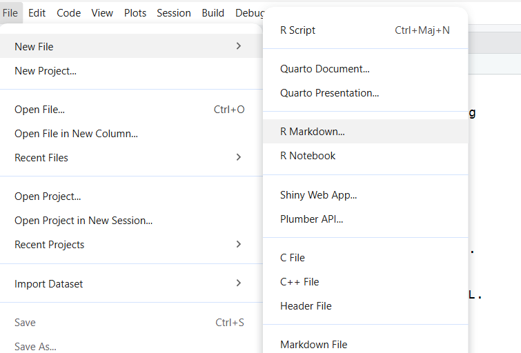

------------------------------------------------------------------------

## Start a document II

Specify the title of your document and the output

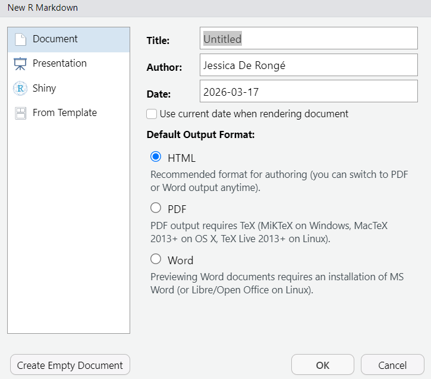

------------------------------------------------------------------------

## Document

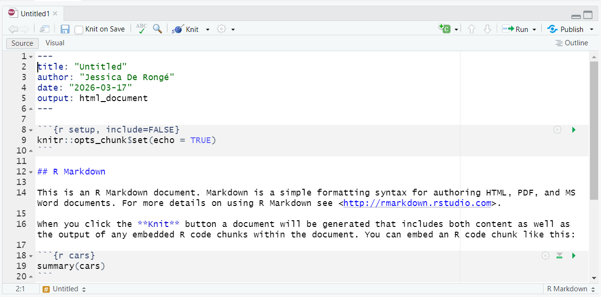

------------------------------------------------------------------------

## YAML

The YAML is the metadata block that defines the output format and defines the options of the format selected.

If you want to add a table of contents to your document, you need to specify `toc: true` in your YAML.

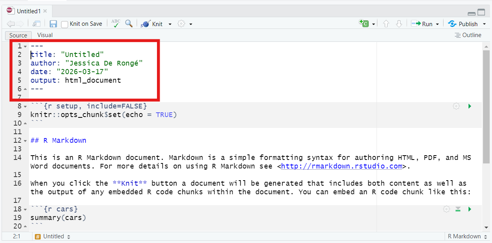

------------------------------------------------------------------------

## Setup chunck

This is a obligatory chunk to keep in your document. This is where you can specify how you want your code to appear in your document.

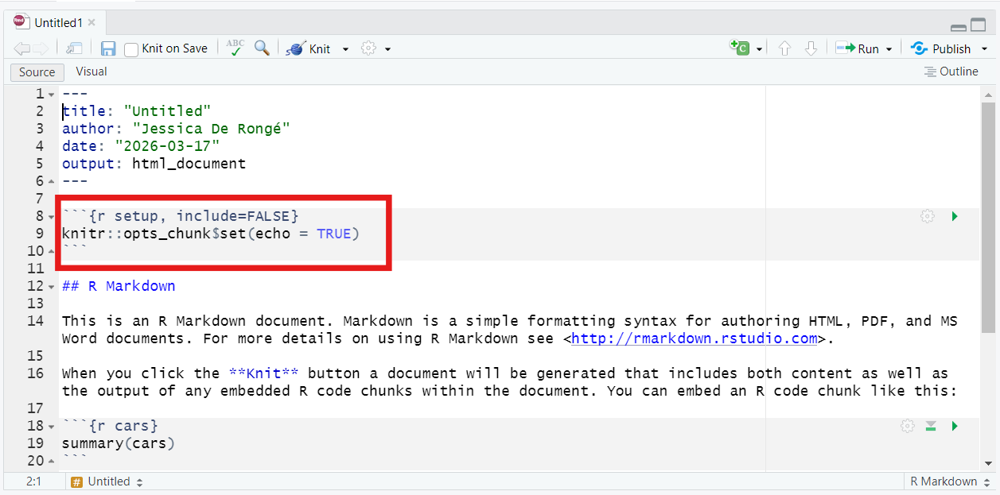

------------------------------------------------------------------------

## Setup options

::: r-fit-text
| Option | Effect |
|------------------------------------|------------------------------------|
| prompt = FALSE | Remove the prompt characters \> from the R code |
| comment = NA | Remove \## from the start of each line of the results. |
| echo = FALSE | Don’t show the code. |
| results = "hide" | Don’t show the results. |
| include = FALSE | Show nothing (run code). |
| eval = FALSE | Don’t run the code. |
| message = FALSE | Preserve messages in the output (the same apply to warnings with warning = FALSE). |
| results = "hold" | Hold all the output pieces and display them after the code chunk. |
| tidy = "styler" | Reformat the R code shown in the output. |
| cache = TRUE | Skip the execution of the code if it has been executed before and nothing in the code has changed since then. This is useful for time-consuming R code. |
:::

------------------------------------------------------------------------

## Include text

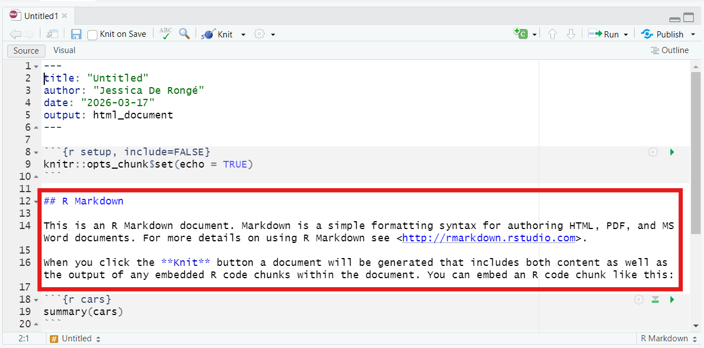

------------------------------------------------------------------------

### Title

To specify a title in the text section of your document you need to use \#

`#` = Title 1

`##` = Title 2 (subtitle)

`###` = Title 3 (subsubtitle)

...

------------------------------------------------------------------------

## Include code

To include code, you need to add a chunk code.

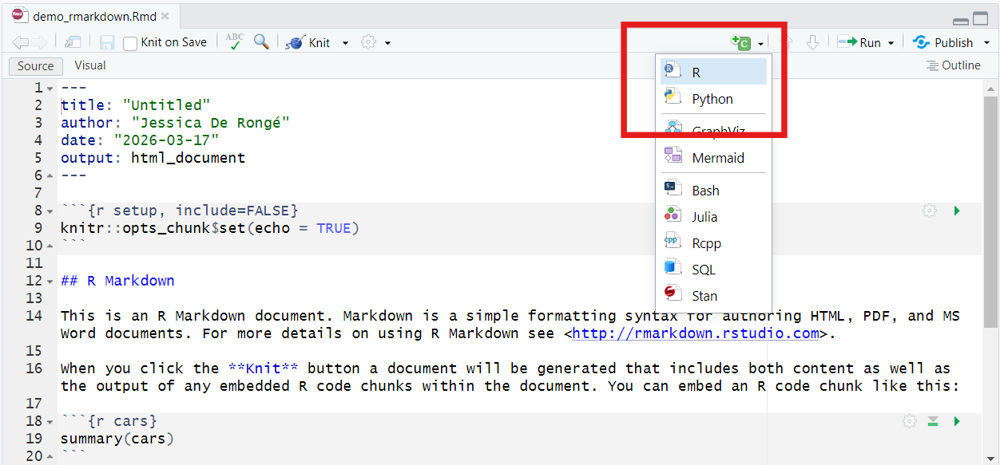

------------------------------------------------------------------------

### R chunk {.scrollable}

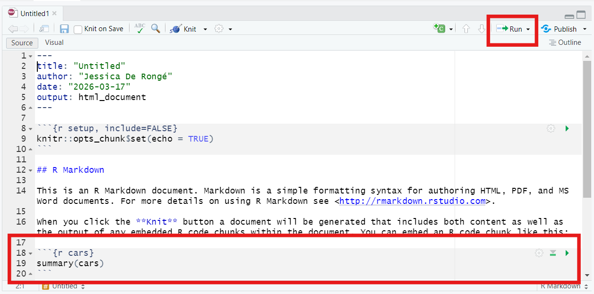

------------------------------------------------------------------------

### Running code

You can run the code before rendering your output.

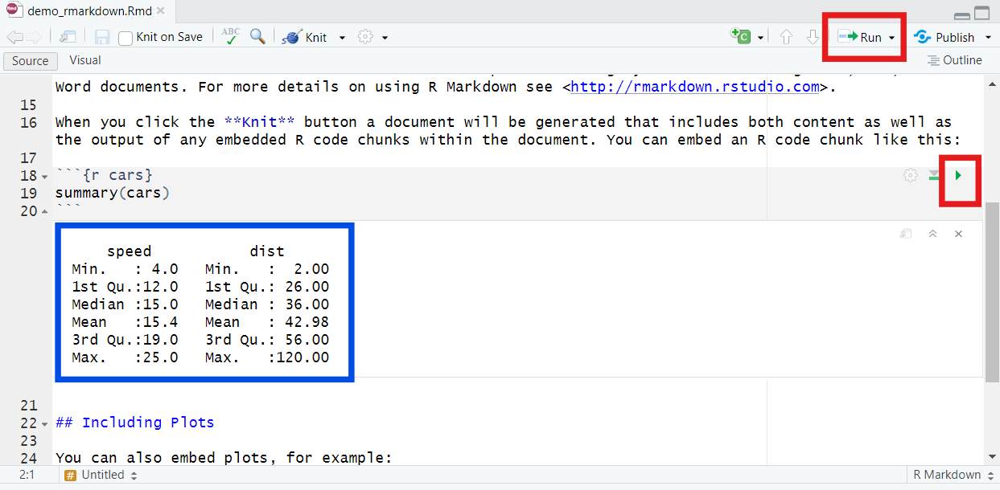

------------------------------------------------------------------------

## Output

To get your html or pdf document, you need to knitr the document.

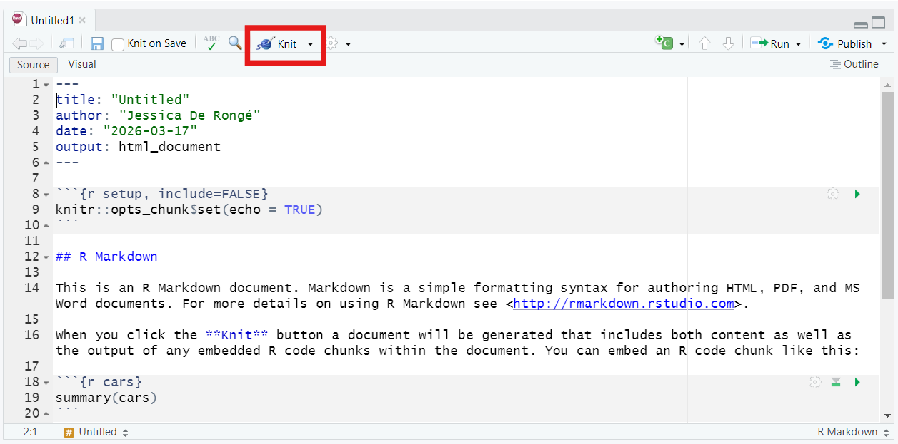

------------------------------------------------------------------------

### PDF document

You need to have Latex installed on your computer or the `tinytex` package in Rstudio.

install.packages("tinytex") tinytex::install_tinytex() to install TinyTeX (TeX distribution)

------------------------------------------------------------------------

### change output format

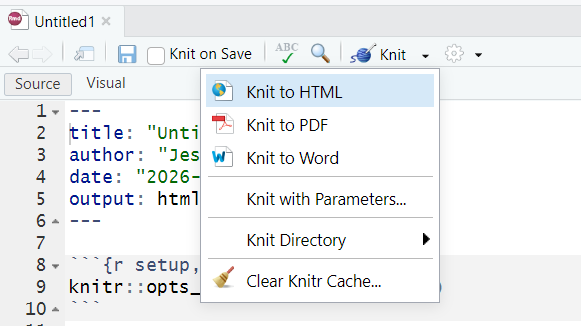

------------------------------------------------------------------------

### Render output

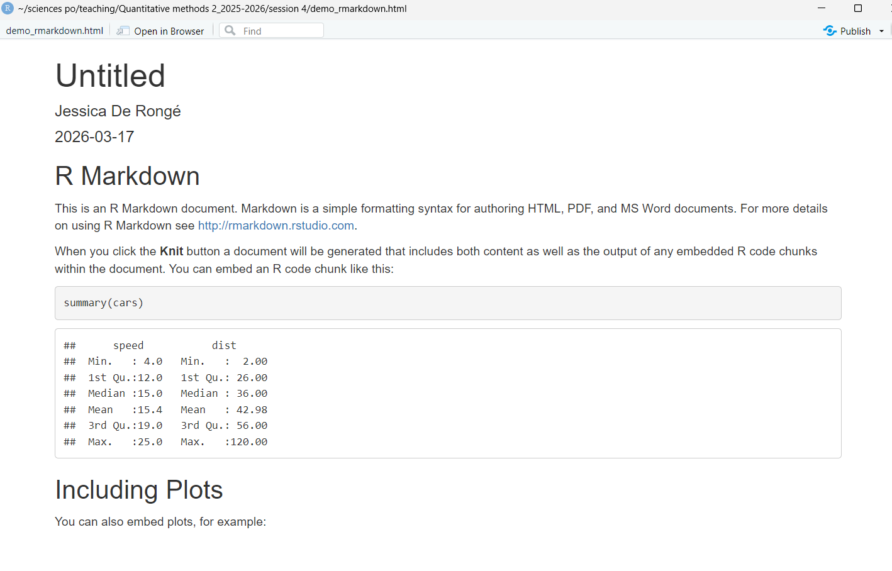

------------------------------------------------------------------------

# Difference-in-Differences

------------------------------------------------------------------------

## Panel Data

What is panel data?

Is there something specific you need to do when using panel data in regression?

------------------------------------------------------------------------

## Panel Data

-   Repeated observations from the same individual

-   Observations are not independent

-   Use individual fixed effects or cluster SE

------------------------------------------------------------------------

## Difference-in-Differences

What is it?

When do you use it?

Which type of data do you need?

------------------------------------------------------------------------

## Difference-in-Differences

-   Causal inference of observational data

-   Regression technique

-   Compare two groups (control vs treatment)

-   Compare Pre and Post treatment

=\> Measure the causal effect of a treatment in terms of change and not levels

------------------------------------------------------------------------

## Difference-in-Differences

$$
Y= \beta_0+\beta_1 Treatment+ \beta_2 Time+ \beta_3 Treatment*Time +\epsilon
$$

-   The causal effect is the interaction effect

------------------------------------------------------------------------

## in R

::: r-fit-text
`lm(formula, data)` :

-   fomula: Y \~ Time\*Treatment (+controls)

-   data: name of the dataset

`feols(formula|FE,cluster=~group,data)`:

-   fomula: Y \~ Time\*Treatment (+controls)

-   FE: fixed effects

-   cluster=\~group: specify that you want clustered SE (if you do not add this argument, you will have IID SE like in lm)

-   data: name of the dataset

With feols function, the stargazer function does not work. You need to use etable().
:::

------------------------------------------------------------------------

## Example: {.scrollable}

Imagine you want to study the effect of a new electoral reform throughout a country. Before introducing the electoral reform, the government decided to test the reform in only some regions of the country. The government wants to know if it introduces mail-in voting, will increase voter turnout.

The dataset contains voter turnout for 2010, 2014 and 2018. The reform was applied to 10 regions for the 2018 elections.

------------------------------------------------------------------------

### Data simulation {.scrollable}

The data has been simulated with this code:

```{r}
set.seed(123)

# Parameters
regions <- LETTERS[1:20]   # 20 regions
years <- c(2010, 2014, 2018)

# Create panel structure
data <- expand.grid(Region = regions, Year = years)

# Treatment assignment (half treated)
treated_regions <- regions[1:10]
data$Treated <- ifelse(data$Region %in% treated_regions, 1, 0)

# Post indicator
data$Post <- ifelse(data$Year == 2018, 1, 0)

# Time trend (common to all regions → ensures parallel trends pre-treatment)
data$TimeTrend <- ifelse(data$Year == 2010, 0,
                  ifelse(data$Year == 2014, 2, 5))

# Region fixed effects (baseline differences)
region_fe <- rnorm(length(regions), mean = 60, sd = 5)
names(region_fe) <- regions
data$RegionFE <- region_fe[data$Region]

# Treatment effect (only applies in post period for treated units)
treatment_effect <- 10
data$TreatmentEffect <- data$Treated * data$Post * treatment_effect

# Random noise
data$epsilon <- rnorm(nrow(data), mean = 0, sd = 2)

# Outcome variable: turnout
data$Turnout <- data$RegionFE +
                data$TimeTrend +
                data$TreatmentEffect +
                data$epsilon

# Keep relevant columns
data <- data[, c("Region", "Year", "Treated", "Post", "Turnout")]
```

------------------------------------------------------------------------

### Model

```{r}
library(stargazer)
reg1<-lm(Turnout~Post*Treated,data=data[data$Year==2014|data$Year==2018,])
stargazer(reg1,type="text")
```

------------------------------------------------------------------------

### Interpretation

-   What is the effect of the new reform on voter turnout?

------------------------------------------------------------------------

------------------------------------------------------------------------

## Parallel trend assumption

The difference-in-differences design is only valid if the parallel trend assumption is valid. The parallel trend assumption is the assumption that before treatment, both the control and treatment had a parallel trend for the outcome variable throughout time. If the parallel trend is wrong, the construction of the counter-factual is wrong, which would create a bias estimator.

------------------------------------------------------------------------

### Parallel trend check

How can you check?

-   Graphically

-   Placebo test

------------------------------------------------------------------------

### Visualisation of parallel trends

```{r}
library(ggplot2)
avg_trends <- aggregate(Turnout ~ Treated + Year, data, mean)
ggplot(avg_trends,aes(x=Year,y=Turnout,color=as.factor(Treated)))+
  geom_point()+
  geom_line()+
  labs(color="Treated")+
  theme_bw()
```

------------------------------------------------------------------------

### Placebo test

```{r}
reg2<-lm(Turnout~Year*Treated,data=data[data$Year==2010|data$Year==2014,])
stargazer(reg2,type="text")
```

------------------------------------------------------------------------

## Example

Based on the data from Angelucci and Cagé, 2019.

We are interested in understanding how the introduction of advertisements in TV programs in France has impacted the revenues of newspapers throughout France. The hypothesis being that it impacted only national newspapers and not local ones.

------------------------------------------------------------------------

### Data

You can find the data [here](https://www.openicpsr.org/openicpsr/project/116438/version/V1/view?path=/openicpsr/116438/fcr:versions/V1/data/dta/Angelucci_Cage_AEJMicro_dataset.dta&type=file). You will need to sign in to be able to download it.

```{r}
library(haven)
library(tidyverse)
newspapers <- read_dta("Angelucci_Cage_AEJMicro_dataset.dta")

newspapers <-
  newspapers |>
  select(
    year, id_news, after_national, local, national, ra_cst, ps_cst, qtotal
    ) |> 
  mutate(ra_cst_div_qtotal = ra_cst / qtotal, 
         after_national =  if_else(year > 1967, 1, 0),
         after_national_placebo = if_else(year >= 1966, 1, 0),
         across(c(id_news, local, national, after_national), as.factor),
         year = as.factor(year)) 
```

------------------------------------------------------------------------

### Model

```{r}
library(fixest)
did<-feols(log(ra_cst) ~ national*after_national|year+id_news,
            cluster=~id_news,
     data = newspapers)

etable(did)
```

------------------------------------------------------------------------

## Placebo check

```{r}
did_placebo <-
  feols(log(ra_cst) ~ national * after_national_placebo | year + id_news,
        cluster=~id_news,
     data = newspapers)
etable(did_placebo)
```

------------------------------------------------------------------------

# Exercises

------------------------------------------------------------------------

## Exercise 1

In the USA, in 2000 a law was passed with the Right To Carry (RTC) arms in certain states (simulated example). US lawmakers are interested in knowing if this increased or not crimes in cities.

------------------------------------------------------------------------

## Exercise 2

In 2021, a few local governments implemented policies with stricter emissions controls, other local governments have not (simulated example). The air quality data is available from 2018 to 2022.

------------------------------------------------------------------------

## Exercise 3

In 2019, some cities decided to introduce a smoking ban on the terraces of bars and restaurants (simulated example). We want to analyse the effect of the smoking ban on the number of hospitalisations linked to respiratory disease. Use the smoking dataset.
