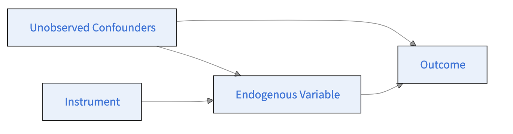

## Last sessions

-   Multinomial regressions
-   Difference-in-differences

## Identification and exogeneity

-   An OLS is a correlational analysis \begin{equation}
    Y_i = \alpha + \beta X_i + \delta D_i + \epsilon_i
    \end{equation}
-   Identifying a causal effect (directional) requires exogeneity and directionality
-   $D \rightarrow Y$
-   otherwise bias can arise

## Identification strategies

-   RDD uses arbitrary decision rule as source of exogeneity
    -   applies in settings where treatment is determined by whether an observed running variable $X$ crosses a known cutoff $c$.
-   IV uses so-called instrument
    -   applies when treatment assignment is influenced by an exogeneous variable

# Regression discontinuity

## Sharp and fuzzy RDD

-   Based on a running variable $X$
-   Which influences probability $P_T(X\geq c)$ discontinuously
-   Many exist out there because of legal thresholds
-   Can be fuzzy or sharp

## Intuition sharp RDD

-   Age and drinking : deterministic

```{r}
#| echo: false

# Load library
library(ggplot2)

# Set seed
set.seed(123)

# Parameters
n <- 500
c <- 0  # cutoff

# Simulate running variable
X <- runif(n, -2, 2)

# Sharp treatment assignment (Heaviside)
D <- ifelse(X >= c, 1, 0)

# Add slight vertical jitter for visualization (so points don't overlap perfectly)
D_jitter <- D + rnorm(n, mean = 0, sd = 0.03)

# Dataframe
df <- data.frame(X, D, D_jitter)

# Create smooth grid for step function
X_grid <- seq(-2, 2, length.out = 1000)
P <- ifelse(X_grid >= c, 1, 0)
df_step <- data.frame(X_grid, P)

# Plot
ggplot() +
  # Cloud of points
  geom_point(data = df, aes(x = X, y = D_jitter), alpha = 0.4) +
  
  # Heaviside step function
  geom_step(data = df_step, aes(x = X_grid, y = P), size = 1) +
  
  # Cutoff line
  geom_vline(xintercept = c, linetype = "dashed") +
  
  labs(
    title = "Sharp RDD: Treatment Probability with Discontinuity",
    x = "Running Variable (X)",
    y = "Treatment (D)"
  ) +
  
  theme_minimal()
```

## Intuition fuzzy RDD

-   Result at an entrance exam and admission rule (informal - yet not decisive threshold at 16/20).

```{r}
#| echo: false

# Load library
library(ggplot2)

# Set seed
set.seed(123)

# Parameters
n <- 500
c <- 0  # cutoff
slope <- 5  # steepness of logistic curve
jump <- 0.3 # size of discontinuity at cutoff

# Simulate running variable
X <- runif(n, -2, 2)

# Logistic probability function
P <- 1 / (1 + exp(-slope * X))

# Add a discontinuity at cutoff
P[X >= c] <- P[X >= c] + jump
P <- pmin(P, 1)  # cap at 1

# Simulate treatment assignment
D <- rbinom(n, 1, P)

# Add vertical jitter for visualization
D_jitter <- D + rnorm(n, mean = 0, sd = 0.03)

# Dataframe for points
df <- data.frame(X, D_jitter)

# Smooth curve for theoretical probability
X_grid <- seq(-2, 2, length.out = 1000)
P_grid <- 1 / (1 + exp(-slope * X_grid))
P_grid[X_grid >= c] <- P_grid[X_grid >= c] + jump
P_grid <- pmin(P_grid, 1)
df_curve <- data.frame(X_grid, P_grid)

# Plot
ggplot() +
  # Cloud of points
  geom_point(data = df, aes(x = X, y = D_jitter), alpha = 0.4) +
  
  # Smooth fuzzy probability curve
  geom_line(data = df_curve, aes(x = X_grid, y = P_grid), color = "blue", size = 1.2) +
  
  # Cutoff line
  geom_vline(xintercept = c, linetype = "dashed") +
  
  labs(
    title = "Fuzzy RDD: Probability of Treatment with Discontinuity",
    x = "Running Variable (X)",
    y = "Pr(D = 1 | X)"
  ) +
  
  theme_minimal()
```

## Measuring the jump at discontinuity

```{r}
#| echo: false

library(tidyverse)
simulated_rdd_data_before_treatment <- 
  tibble(
    outcome = rnorm(200, mean = 1, sd = 1),
    running_variable = c(1:200),
    treatment = "before treatment"
  ) 

simulated_rdd_data_after_treatment <- 
  tibble(outcome = rnorm(200, mean = 3, sd = 1),
        running_variable = c(201:400),
        treatment = "after treatment"
  )

rbind(simulated_rdd_data_before_treatment, 
      simulated_rdd_data_after_treatment) |> 
  ggplot(aes(x = running_variable, y = outcome, color = treatment)) +
  geom_point(alpha = 0.5) +
  geom_smooth(formula = y ~ x, method = "loess") +
  theme_minimal() +
  theme(legend.position = "bottom") +
  scale_color_brewer(palette = "Set1")
```

## Impact on the outcome

-   This jump helps assess the impacts of the treatment on the outcome \begin{equation}
    \tau = \lim_{x \to c^+} \mathbb{E}[Y_i \mid X_i = x] - \lim_{x \to c^-} \mathbb{E}[Y_i \mid X_i = x]
    \end{equation}
-   $c^+ = c+h$ and $c^- = c-h$ with $h \rightarrow 0$
-   Trade-off between
    -   bias (\$h \text{ big} \rightarrow \text{bias} \$)
    -   statistical power ($h \text{ small} \rightarrow n \text{ small}$)

## Example

-   Scholarship and GPA

```{r}
#| echo: false
# Set seed for reproducibility
set.seed(123)

# Parameters
n <- 300           # number of students
cutoff <- 80       # scholarship cutoff
slope <- 0.05      # linear trend of GPA with score
jump <- 0.5        # effect of scholarship on GPA

# Simulate exam scores
X <- runif(n, 60, 100)

# Simulate GPA: linear trend + jump at cutoff + noise
Y <- 2 + slope * X + ifelse(X >= cutoff, jump, 0) + rnorm(n, 0, 0.2)

# Create dataframe
df <- data.frame(X, Y)
```

```{r}
#| echo: false

ggplot(df, aes(x = X, y = Y)) +
  geom_point(alpha = 0.6) +
  # Separate regression lines on each side of cutoff
  geom_smooth(data = subset(df, X < cutoff), aes(x = X, y = Y), method = "lm", color = "blue", se = FALSE) +
  geom_smooth(data = subset(df, X >= cutoff), aes(x = X, y = Y), method = "lm", color = "red", se = FALSE) +
  # Vertical line at cutoff
  geom_vline(xintercept = cutoff, linetype = "dashed") +
  labs(
    title = "RDD: Effect of Scholarship on GPA",
    x = "Entrance Exam Score",
    y = "GPA after 1 Year"
  ) +
  theme_minimal()
```

## Example {.scrollable}

\begin{equation}
Y_{i\{h\}} = \alpha + \beta X_{i\{h\}} + \delta D_{i\{h\}} + \epsilon_i
\end{equation}

```{r}
library(tidyverse)
library(MASS)
library(stargazer)
# Define the bandwidth
h <- 10  

# Subset data within ± the threshold
rd_data1<- df |> 
  filter(abs(X - 80) <= h)

rd_data2<- df |> 
  filter(abs(X - 80) <= 0.1*h)


# Create running variable centered at the threshold
rd_data1 <- rd_data1 |> 
  mutate(
    centered_X = X - 80,  # Centering at the threshold
    treatment = if_else(X >= 80, 1, 0) # Treatment indicator
  )

rd_data2 <- rd_data2 |> 
  mutate(
    centered_X = X - 80,  # Centering at the threshold
    treatment = if_else(X >= 80, 1, 0) # Treatment indicator
  )

# Estimate local linear regression with interaction
rd_model1 <- lm(Y~ treatment + centered_X, data = rd_data1)
rd_model2 <- lm(Y~ treatment + centered_X, data = rd_data2)

#Compare the models

stargazer(rd_model1, rd_model2, type = "text")
```

## Using built-in functions

```{r}
library(rdrobust)
# Parameters

# Run robust RDD
rdd_result <- rdrobust(y = df$Y, x = df$X, c = cutoff, h = 10) # h = points allows to specify the number of points

# Print summary
summary(rdd_result)
```

## Continuity at the cutoff {.scrollable}

-   Absent of treatment, $Y$ would have followed a continuous trend at the cutoff.
-   Typical tests
    -   **Covariate continuity tests** : placebos with other covariates
    -   **McCrary density test**: test whether the density of the running variable is continuous at the cutoff, which helps detect manipulation or sorting around the threshold.
    -   **Placebos** with other cutoffs
    -   **Varying bandwidths**: verify that results are robust to different choices of bandwidth.
    -   **Varying polynomial orders**: check that results are not driven by a specific functional form, by changing the order of the estimation in the argument of the function `p =`.

# Instrumental variables

## Intuition



## Conditions of good instrument

1.  Affects the treatment (relevance),

2.  Does not directly affect the outcome except through the treatment (exclusion restriction),

3.  Is independent of unobserved confounders (validity).

## Two-stage least squares


-   1st stage : \begin{equation}
    D_i = \alpha + \beta Z_i + \epsilon_i
    \end{equation}

-   2nd stage : \begin{equation}
    Y_i = \alpha + \beta X_i+ \delta \hat{D}_i + \epsilon_i
    \end{equation}

## How to run your IV {.scrollable}

-   Successive `lm`

    -   1st stage `Treatment ~ Instrument`
    -   2nd stage `Outcome ~ fitted_treatment`

-   You want to estimate earnings depending on education

    -   instead of OLS, use of an instrument
    -   distance to school

    ```{r}
    # Load required package
    library(AER)  # For ivreg (2SLS)
    library(estimatr)
    set.seed(123)

    # Sample size
    n <- 500

    # Instrument: distance to nearest college (in km, exogenous)
    distance_to_college <- runif(n, 0, 50)  # 0 = very close, 50 = far

    # Unobserved confounder: ability or motivation
    ability <- rnorm(n, 0, 1)

    # Treatment: years of education (depends on distance and ability)
    # Students closer to college tend to get more education
    education <- 12 + 0.05 * (50 - distance_to_college) + 0.8 * ability + rnorm(n, 0, 1)
    # education is continuous: years of schooling

    # Outcome: earnings (depends on education and ability)
    earnings <- 20000 + 1500 * education + 5000 * ability + rnorm(n, 0, 5000)

    # Combine into a data frame
    df <- data.frame(earnings, education, distance_to_college, ability)

    # Quick look
    head(df)

    # Naive OLS (biased because of ability confounding)
    lm_first <- lm(education ~ distance_to_college, data = df)

    df$fitted_educ <- lm_first$fitted.values
    ivcom <- lm(earnings ~ fitted_educ, data = df)
    summary(ivcom)


    naive_lm <- lm(earnings ~ education, data = df)
    summary(naive_lm)
    ```

## Using built-in functions {.scrollable}

-   packages

```{r}
library(AER)  # For ivreg (2SLS)
library(estimatr)
```

-   Function

```{r}
#| eval: false
iv <- ivreg(Y ~ X | D+X, data)
```

```{r}
# 2SLS using distance as instrument
iv_model <- ivreg(earnings ~ education | distance_to_college, data = df)
iv_model2 <- iv_robust(earnings ~ education | distance_to_college, data = df)
summary(iv_model, diagnostics = TRUE)
summary(iv_model2)
```

## Diagnostics

-   Weak instruments : rejected (F statistic \~ 150 \>\> 10)
-   Wu-Hausman test : is education exogeneous ? If yes, OLS would be fine.
-   Sargan test : in case you have multiple instruments

# Exercices

## Exercice 1

## Load the relevant packages

Start by loading the following packages:

```{r}
#| eval: false
#| echo: true

library(rio)
library(tidyverse)
library(rdrobust)
library(estimatr)
library(AER)
```

## Exercice 1: regression discontinuity design (RDD) {.scrollable}

This exercise is inspired by Carpenter and Dobkin (2015). You are provided with a data set about crime rates in the US, which you can find at <https://github.com/scpo-quantimethods/quantitative_methods_two/raw/main/exercices/exercices5/data/carpenter_dobkin_data.dta>. You want to analyse the effect of alcohol on crime rates.

1.  Import the data. The codebook is the following :

-   `age` stands for the age
-   `arrested_for` qualifies the reasons for which people have been arrested. `DUI` stands for driving under the influence.
-   `number` is the number of people of that age arrested for that reason.

2.  Run the following code :

```{r}
#| eval: false
p <- data_set %>%  ggplot(aes(x = age, y = number)) +
  geom_point(alpha = 0.05) +
  facet_wrap(facets = vars(arrested_for), scales = "free_y") +
  theme_minimal()

p
```

3.  Do you observe any “jump” or discontinuity in your graphs? If so, where?

4.  Restrict your dataset to DUIs (driving under the influence).

5.  Run your regression discontinuity using rdrobust, with age as the independent variable and number as the dependent variable, using a cutoff at 21 and a bandwidth of 2.

6.  Is this a sharp or fuzzy RDD?

7.  Does being allowed to drink alcohol affect the number of DUIs?

8.  Repeat the analysis using the number of assaults and the legal majority at 18 to examine whether turning 18 has an impact on the number of assaults.

```{r}
#| eval: true
#| echo: true

library(rio)
library(tidyverse)
library(rdrobust)
library(estimatr)
library(AER)

carpenter_dobkin_prepared <- import("https://github.com/scpo-quantimethods/quantitative_methods_two/raw/main/exercices/exercices5/data/carpenter_dobkin_data.dta")

glimpse(carpenter_dobkin_prepared)
p <- carpenter_dobkin_prepared %>%  ggplot(aes(x = age, y = number)) +
  geom_point(alpha = 0.05) +
  facet_wrap(facets = vars(arrested_for), scales = "free_y") +
  theme_minimal()

p

carpenter_dobkin_dui_only <-
  carpenter_dobkin_prepared |>
  filter(
    arrested_for == "DUI"
  )

carpenter_dobkin_assault_only <-
  carpenter_dobkin_prepared |>
  filter(
    arrested_for == "Assault"
  )

rdd_dui <- rdrobust(
  # specifies the DV
  y = carpenter_dobkin_dui_only$number,
  # specifies the running variable of the RDD
  x = carpenter_dobkin_dui_only$age,
  # specifies the cutoff
  c = 21,
  # specifies the bandwidth, here the unit of analysis is years
  h = 2
) 

rdd_assault <- rdrobust(
  # specifies the DV
  y = carpenter_dobkin_assault_only$number,
  # specifies the running variable of the RDD
  x = carpenter_dobkin_assault_only$age,
  # specifies the cutoff
  c = 18,
  # specifies the bandwidth, here the unit of analysis is years
  h = 2
) 

rdd_dui |> summary()
rdd_assault %>% summary()


rdd_dui <- rdrobust(
  # specifies the DV
  y = carpenter_dobkin_dui_only$number,
  # specifies the running variable of the RDD
  x = carpenter_dobkin_dui_only$age,
  # specifies the cutoff
  c = 21,
  # specifies the bandwidth, here the unit of analysis is years
) 

rdd_assault <- rdrobust(
  # specifies the DV
  y = carpenter_dobkin_assault_only$number,
  # specifies the running variable of the RDD
  x = carpenter_dobkin_assault_only$age,
  # specifies the cutoff
  c = 18,
  # specifies the bandwidth, here the unit of analysis is years
) 

rdd_dui |> summary()
rdd_assault %>% summary()
```
